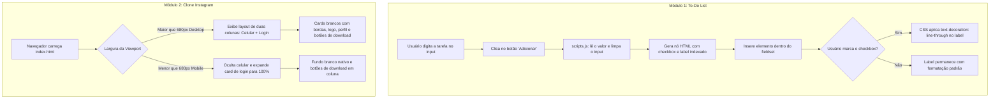

# 🚀 DIO Projects — Repositório de Desafios Front-End (Bootcamp Spread)

<br />

<div align="center">

[](https://developer.mozilla.org/pt-BR/docs/Web/HTML)
[](https://developer.mozilla.org/pt-BR/docs/Web/CSS)
[](https://developer.mozilla.org/pt-BR/docs/Web/JavaScript)
[](https://www.dio.me/)
[](https://www.dio.me/)
[](LICENSE)
[](#)

</div>

---

## 🔗 Acesso e Execução

Este repositório é um **monorepo educacional modular** composto por duas aplicações front-end independentes baseadas em tecnologias web nativas. Ambas podem ser executadas diretamente em qualquer navegador moderno ou através de um servidor web local.

* **Módulo 1:** `Introducao- To-Do List/` — Gerenciador prático de tarefas com DOM dinâmico.
* **Módulo 2:** `Projeto Instagram - Login-Troca/` — Clone responsivo da interface web de autenticação do Instagram.

---

## 📖 Visão Geral

O **DIO Projects** é o repositório centralizador criado para documentar e armazenar o progresso técnico e os desafios práticos desenvolvidos durante o bootcamp **Spread Fullstack Developer**, promovido pela [Digital Innovation One (DIO)](https://www.dio.me/).

O objetivo pedagógico deste conjunto de projetos foi sedimentar a compreensão dos pilares fundamentais da web (**HTML5 semântico**, **estilização avançada com CSS3** e **manipulação imperativa da árvore DOM com JavaScript Vanilla**), priorizando o aprendizado das APIs nativas do navegador sem a utilização de frameworks ou bibliotecas pré-fabricadas.

---

## ✨ Módulos Integrados e Funcionalidades

### 📝 1. Módulo: Introdução — To-Do List (`Introducao- To-Do List/`)
* **Adição Dinâmica de Afazeres:** Campo de texto interativo com botão de inserção que instancia elementos dinâmicos na lista.
* **Marcação de Status com Checkbox:** Checkboxes interativos com identificadores únicos incrementais (`tarefa0`, `tarefa1`, ...).
* **Efeito Visual de Tarefa Concluída:** Utilização do seletor CSS de irmão adjacente (`input:checked + label`) para aplicar automaticamente o efeito de risco tachado (`text-decoration: line-through`) ao marcar a caixa de seleção.
* **Design Leve e Amigável:** Paleta em tons de azul suave (`rgb(105, 197, 255)` e `rgb(227, 248, 255)`) com a tipografia Google Font **Open Sans**.

---

### 📸 2. Módulo: Projeto Instagram — Login & Troca de Conta (`Projeto Instagram - Login-Troca/`)
* **Layout Fiel ao Instagram Web:**
  * Mockup de smartphone à esquerda (`img/instagram-celular.png`) apresentando a tela do feed.
  * Painel de autenticação à direita com logotipo clássico (`img/instagram-logo.png`), avatar circular do perfil (`img/perfil-instagram.jpg`), botão azul de acesso rápido (*"Continue como erickysantana"*) e link para remoção de credenciais.
* **Card Secundário de Alternância:** Área para troca de usuário ativo (*"Não é erickysantana? Trocar de Conta ou Cadastre-se"*).
* **Seção de Download Oficial:** Selos dimensionados das lojas de aplicativos **Apple App Store** e **Google Play Store**.
* **Responsividade com Media Queries:** Adaptação completa para telas menores que `680px`, recolhendo o mockup do smartphone e adaptando os formulários em uma coluna única centralizada.

---

## 🎯 Diferenciais e Destaques Técnicos

1. **Estrutura Modular sem Dependências Externas:** Ambas as aplicações foram construídas exclusivamente com recursos nativos dos navegadores, garantindo execução instantânea e portabilidade absoluta.
2. **Manipulação de DOM com JavaScript Puro:** No módulo To-Do List, a criação de elementos ocorre em tempo de execução via injeção controlada de nós no container `<fieldset>`, gerando pares correlacionados de `<input type="checkbox">` e `<label for="...">`.
3. **Estilização Reativa sem JavaScript no To-Do List:** O efeito de tachar tarefas concluídas dispensa a manipulação de classes via script; ele é realizado puramente pelo motor de renderização do CSS via seletor combinador `:checked + label`.
4. **Alinhamento Flexbox e Adaptação Responsiva no Instagram Clone:** Uso sistemático de containers Flexbox com regras de alinhamento (`justify-content`, `align-items`, `flex-direction`) associados a Media Queries em `1024px`, `680px` e `300px`.

---

## 🏗️ Arquitetura e Estrutura de Pastas

```bash
dio_projects/
├── README.md                                  # Documentação técnica e guia do monorepo
│
├── Introducao- To-Do List/                    # Módulo 1: Lista de Tarefas Interativa
│   ├── index.html                             # Estrutura com campo de entrada e fieldset
│   └── assets/
│       ├── css/
│       │   └── style.css                      # Estilos, fonte Open Sans e seletor :checked
│       └── js/
│           └── scripts.js                     # Função adicionar() e manipulação do DOM
│
└── Projeto Instagram - Login-Troca/           # Módulo 2: Clone da Interface do Instagram
    ├── index.html                             # Estrutura dos cards de login e mockup
    ├── style.css                              # Layout Flexbox, cores oficiais e responsividade
    └── img/                                   # Ativos gráficos de alta fidelidade
        ├── apple-button.png                   # Selo Apple App Store
        ├── googleplay-button.png              # Selo Google Play Store
        ├── instagram-celular.png              # Mockup do celular com feed
        ├── instagram-logo.png                 # Tipografia vetorial do Instagram
        └── perfil-instagram.jpg               # Imagem de perfil do usuário
```

---

## 🔄 Fluxo de Funcionamento dos Módulos



---

## 🎨 UX, Design e Interfaces

### Módulo 1: To-Do List
* **Tipografia:** Google Font **Open Sans** (pesos 300 e 600).
* **Paleta de Cores:**
  * Fundo da Aplicação: `#ffffff` (Branco neutro).
  * Bordas e Botão de Ação: `rgb(105, 197, 255)` (Azul ciano vibrante).
  * Fundo do Botão: `rgb(227, 248, 255)` (Azul pastel claro).

### Módulo 2: Instagram Login Clone
* **Tipografia:** Fonte padrão do sistema `sans-serif` com escala de `14px`.
* **Paleta de Cores:**
  * Azul Primário do Instagram: `#0095f6` (Botão de login e links de ação).
  * Fundo Desktop: `rgb(243, 243, 243)` (Cinza claro para destacar os cards brancos).
  * Linhas Divisórias: `1px solid lightgray`.

---

## 🎓 Objetivo do Projeto

Repositório concebido para consolidar na prática os tópicos abordados na trilha **Spread Fullstack Developer** da **Digital Innovation One (DIO)**:
* Introdução à lógica de programação para a web.
* Manipulação prática de árvores de elementos DOM com JavaScript.
* Criação de interfaces ricas com CSS puro e Flexbox.
* Desenvolvimento com metodologia orientada a responsividade (*Responsive Web Design*).

---

## ⚙️ Requisitos e Instalação

### Pré-requisitos
* Qualquer navegador web moderno instalado (Chrome, Firefox, Edge, Safari).
* [Git](https://git-scm.com/) para clonar o repositório.

### Instalação

1. Clone o repositório em seu ambiente:
```bash
git clone https://github.com/erickystn/dio_projects.git
```

2. Entre no diretório do projeto:
```bash
cd dio_projects
```

---

## 🚀 Como Executar

Por se tratarem de aplicações puramente estáticas compostas por arquivos `.html`, `.css` e `.js`, a inicialização é imediata:

### 📝 Módulo 1: To-Do List
* Abra o arquivo diretamente no navegador:
  ```bash
  # Linux / macOS
  open "Introducao- To-Do List/index.html"
  
  # Windows
  start "Introducao- To-Do List/index.html"
  ```
* Ou acesse a pasta no VS Code e utilize a extensão **Live Server**.

---

### 📸 Módulo 2: Projeto Instagram Login
* Abra o arquivo diretamente no navegador:
  ```bash
  # Linux / macOS
  open "Projeto Instagram - Login-Troca/index.html"
  
  # Windows
  start "Projeto Instagram - Login-Troca/index.html"
  ```

---

## 💻 Exemplos de Código

### 1. Injeção Dinâmica de Tarefas (`Introducao- To-Do List/assets/js/scripts.js`)
```javascript
let index = 0;

function adicionar() {
    const input = document.getElementById('tarefas');
    const tarefa = input.value.trim();
    if (!tarefa) return;

    input.value = '';

    const lista = document.querySelector(".list > fieldset");
    const elemento = `
        <div class="opt">
            <input type="checkbox" name="tarefa${index}" id="tarefa${index}">
            <label for="tarefa${index}">${tarefa}</label>
        </div>
    `;

    lista.innerHTML += elemento;
    index++;
}
```

---

### 2. Estilização Reativa de Tarefa Tachada (`Introducao- To-Do List/assets/css/style.css`)
```css
.opt input:checked + label {
    text-decoration: line-through;
    color: #888;
}
```

---

### 3. Media Query Responsiva do Clone Instagram (`Projeto Instagram - Login-Troca/style.css`)
```css
@media (max-width: 680px) {
    body {
        background-color: #fff;
    }
    .instagram-wrapper {
        width: 90%;
    }
    .instagram-phone {
        display: none;
    }
    .instagram-continue {
        width: 100%;
    }
    .group {
        border: none;
    }
}
```

---

## 🧪 Suíte de Testes e Validação

Ambos os módulos foram validados através de testes de usabilidade e inspeção de layout:
1. **To-Do List:** Validação da criação sequencial de múltiplos afazeres, persistência visual do estado checado nos checkboxes e alinhamento do texto.
2. **Instagram Clone:** Validação de comportamento responsivo em resoluções de 1440px (Desktop), 768px (Tablet) e 375px (Mobile).

---

## 🛠️ Tecnologias Utilizadas

| Tecnologia | Função no Repositório |
| :--- | :--- |
| **[HTML5](https://developer.mozilla.org/pt-BR/docs/Web/HTML)** | Estruturação semântica dos dois módulos (`fieldset`, `input`, `form`, `main`). |
| **[CSS3](https://developer.mozilla.org/pt-BR/docs/Web/CSS)** | Posicionamento Flexbox, seletores adjacentes (`:checked + label`) e Media Queries. |
| **[JavaScript Vanilla](https://developer.mozilla.org/pt-BR/docs/Web/JavaScript)** | Manipulação do DOM para adição de elementos em tempo real no To-Do List. |
| **[Google Fonts](https://fonts.google.com/)** | Tipografia Open Sans integrada ao módulo de tarefas. |
| **[DIO](https://www.dio.me/)** | Plataforma educacional responsável pelas mentorias e desafios práticos. |

---

## 📈 Melhorias e Próximos Passos (Roadmap)

- [ ] **Persistência em LocalStorage no To-Do List:** Salvar as tarefas cadastradas na Web Storage API para não perder as notas ao atualizar a página.
- [ ] **Botão de Exclusão Individual:** Adicionar botão de lixeira ao lado de cada tarefa para remoção seletiva.
- [ ] **Página de Hub Central:** Criar um `index.html` na raiz do repositório conectando os links de acesso de ambos os módulos.
- [ ] **Interatividade no Clone do Instagram:** Criar tela de formulário com inputs reais de login e senha para alternância com o botão de continuar.

---

## 🤝 Como Contribuir

1. Faça um **Fork** do repositório.
2. Crie uma branch com sua melhoria:
   ```bash
   git checkout -b feature/minha-melhoria
   ```
3. Realize seus commits semânticos:
   ```bash
   git commit -m "feat: adiciona persistencia com LocalStorage no To-Do List"
   ```
4. Envie as modificações para o seu repositório remoto:
   ```bash
   git push origin feature/minha-melhoria
   ```
5. Abra um **Pull Request** para revisão.

---

## 👤 Autor & Créditos

* **Desenvolvedor:** [Ericky Sant'ana](https://github.com/erickystn)
* **Formação e Desafios:** Projetos acadêmicos desenvolvidos no bootcamp **Spread Fullstack Developer** na [Digital Innovation One (DIO)](https://www.dio.me/).

---

## 📄 Licença

Este projeto está sob a licença **MIT**. Consulte o arquivo de licença ou utilize livremente o código para fins educacionais, estudos e referências de desenvolvimento web.
